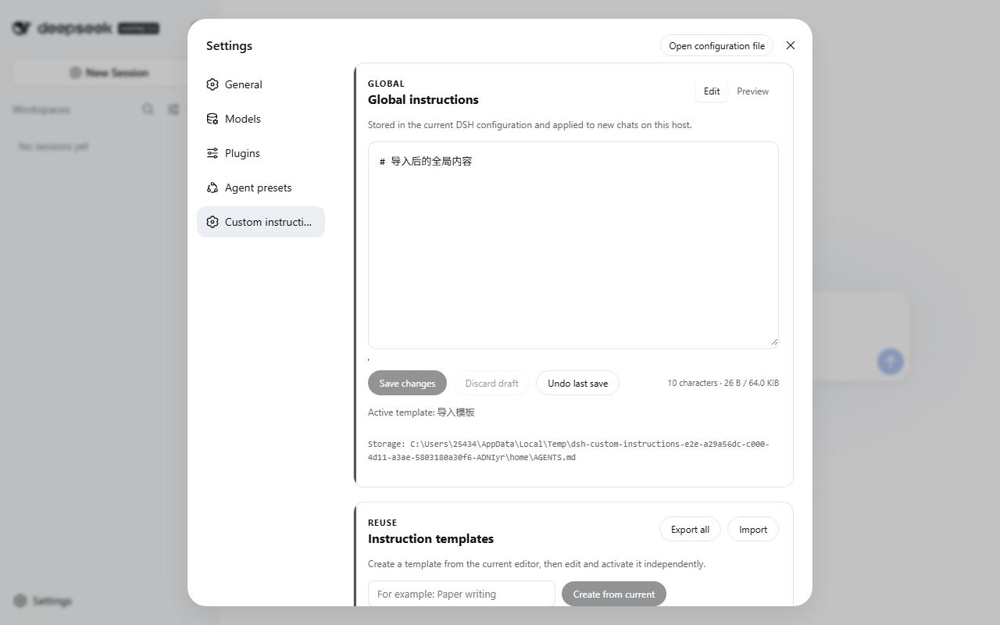

# dsh-custom-instructions

[中文](README.md) · [Changelog](CHANGELOG.md) · [Security](SECURITY.md) · [Contributing](CONTRIBUTING.md)

[](https://github.com/huanghai-lab/dsh-custom-instructions/actions/workflows/ci.yml)
[](https://www.npmjs.com/package/@huanghai-lab/dsh-custom-instructions)
[](https://www.npmjs.com/package/@huanghai-lab/dsh-custom-instructions)
[](LICENSE)


A safe instruction manager for DSH Web: edit the global `AGENTS.md`, reuse templates, preview Markdown, restore history, and block silent overwrites when another window or program changes the data.

It is a portable, recoverable, conflict-safe workspace for global instructions rather than a bare rules textarea.

> Stable v0.4.0 supports DSH `0.1.1-rc.2`. Keep using plugin v0.3.0 on older DSH installations.

> Preview v0.5.0-alpha.2 tracks the official [`dsh-v0.1.2-alpha.1`](https://github.com/deepseek-ai/deepseek-harness/releases/tag/dsh-v0.1.2-alpha.1), and has passed a tagged-source build, isolated plugin-tarball installation, and real browser E2E. Upstream has not published this DSH preview to npm; only testers running the official source build should install this plugin's `next` version.

## Quick start

Requirements: Node.js `^22.19.0 || >=24.0.0`, pnpm, and DSH `0.1.1-rc.2`.

```bash
dsh plugin --profile web add @huanghai-lab/dsh-custom-instructions
dsh web
```

Restart the Web profile, then open **Settings → Custom instructions**.

When running the official DSH `0.1.2-alpha.1` source build, install the preview:

```bash
dsh plugin --profile web add @huanghai-lab/dsh-custom-instructions@next
```



The UI follows the DSH locale and falls back to English. A Chinese screenshot is available at [docs/assets/settings-zh.png](docs/assets/settings-zh.png).

## Features

| Feature | Current behavior |
|---|---|
| Global instructions | Save, discard draft, undo last save, edit/Markdown preview; 65 KiB limit |
| Browser draft | Stored in `sessionStorage` per DSH profile; cleared after save or explicit discard |
| Conflict protection | Every mutation checks a disk-derived `revision`; conflicts preserve the draft |
| Templates | Unicode names, independent edit/preview/save, activate, and confirmed delete; up to 50 |
| History | Snapshot before every replacement, expandable preview and confirmed restore; newest 100 |
| Import/export | Current content, templates, history, and active state; strict validation and rollback |
| Project instruction overview | Read-only project `AGENTS.md` status for registered workspaces |
| Accessibility | Keyboard save, focus restoration, ARIA, native dialogs/file picker, responsive layout |

Markdown previews use DSH's official `MarkdownText`; the plugin does not ship another Markdown parser.

## Data safety

- The plugin writes only `$DSH_HOME/AGENTS.md` and its sibling `instructions/` data. Project instructions remain read-only.
- Every mutation supplies a SHA-256 `revision` derived from actual disk content. A multi-window or external edit returns `409` instead of being overwritten.
- Mutations are serialized inside the DSH process. Files are written to a same-directory temporary file, read back for verification, and then replaced.
- Before replacing global content, the previous value is written to `AGENTS.md.bak` and history. Undo is offered only when the backup truly exists.
- Imports are fully validated before execution. A failed write restores the pre-import snapshot; the latest snapshot is retained as `instructions/import-rollback.json`.
- Each content item is limited to 65 KiB. Imports allow at most 50 templates, 100 history entries, and a 16 MiB request body.
- This plugin adds no product telemetry and does not change DSH's own telemetry setting.

Exports, backups, history, and rollback bundles may contain private instructions or paths. Treat them as sensitive and do not paste them into public issues without redaction.

## Storage layout

```text
$DSH_HOME/
├── AGENTS.md
├── AGENTS.md.bak
└── instructions/
    ├── active.json
    ├── import-rollback.json
    ├── templates/
    └── history/
```

Template filenames use Node's native Base64URL encoding. Display names are never appended directly to filesystem paths.

## Upgrade from v0.3.0

```bash
dsh plugin --profile web add @huanghai-lab/dsh-custom-instructions@0.4.0
```

Export once from v0.3.0 before upgrading. v0.4.0 reads v0.3 ASCII template files and numeric history IDs; a legacy template migrates to the encoded filename on its first successful write. v0.3 exports and bundles without a `format` field are parsed as v0.3 data.

If DSH is not yet `0.1.1-rc.2`, keep the old plugin:

```bash
dsh plugin --profile web add @huanghai-lab/dsh-custom-instructions@0.3.0
```

## Import behavior

- Same-name templates are updated; extra local templates are kept. A merged total above 50 is rejected.
- History is merged by ID and trimmed to the newest 100 entries.
- Current content and active state are imported. The active template must exist after merging.
- One invalid field, template, or history entry rejects the entire import.
- Exports contain saved data only, not an unsaved browser draft.

## Troubleshooting

### “Custom instructions” is missing

Confirm that the package is installed into the `web` profile, then restart DSH:

```bash
dsh plugin --profile web why @huanghai-lab/dsh-custom-instructions
dsh web
```

### The page reports a revision conflict

Choose **Copy draft**, then **Load latest**, merge manually, and save again. Repeated clicks do not bypass the protection.

### The page cannot load or write

Check the displayed storage path, `$DSH_HOME` permissions, and DSH logs. The host distinguishes `400`, `404`, `409`, `413`, and `500`; the client also reports network, empty-response, and non-JSON failures.

### The plugin stopped loading after a DSH upgrade

Stable v0.4.0 guarantees compatibility only with `0.1.1-rc.2`. Preview v0.5.0-alpha.2 removes the client runtime deleted by `0.1.2-alpha.1`, supports the new Markdown labels and browser-authentication APIs, and has completed isolated installation against the official tagged source build.

## Compatibility

| Plugin | DSH | Node.js | Status |
|---|---|---|---|
| v0.5.0-alpha.2 (`next`) | `0.1.2-alpha.1` | `^22.19.0 || >=24` | Preview; tagged-source build, isolated plugin-tarball installation, and real browser E2E passed |
| v0.4.0 | `0.1.1-rc.2` | `^22.19.0 || >=24` | Released and isolated-install E2E verified |
| v0.3.0 | `0.1.0-rc.6` | `^22.19.0 || >=24` | Legacy environments |

## Development and verification

```bash
pnpm install --frozen-lockfile
pnpm typecheck
pnpm test
pnpm build
pnpm compat:dsh /path/to/deepseek-harness
pnpm typecheck:dsh-source /path/to/deepseek-harness
pnpm e2e -- /path/to/deepseek-harness
```

First run the locked install and build in the official `dsh-v0.1.2-alpha.1` source checkout. `pnpm e2e -- <source-directory>` uses that build and the current plugin tarball, creates an isolated `DSH_HOME` and workspace under the OS temporary directory, then exercises one-time login, save, preview, templates, history, import/export, and both locales in the real GUI. It never touches the user's real `AGENTS.md`.

`pnpm compat:dsh` checks the DSH source directory for the client Context, Markdown, settings, workspace, and Web route interfaces used by this plugin. CI runs it against the official `dsh-v0.1.2-alpha.1` tag.

CI runs locked install, typecheck, tests, build, and committed-`lib` freshness on Node 24 for Ubuntu and Windows. Ubuntu also builds the official alpha tag, typechecks against its declarations, and runs isolated browser E2E. Once upstream npm packages are installable, the npm installation path must still be rechecked against the published artifacts.

## Community

Use the [issue templates](https://github.com/huanghai-lab/dsh-custom-instructions/issues/new/choose) for reproducible bugs, and [Discussions](https://github.com/huanghai-lab/dsh-custom-instructions/discussions) for usage notes and ideas. Report vulnerabilities privately as described in [SECURITY.md](SECURITY.md).

If the plugin genuinely helps, a Star, a concrete use case, or a reproducible report all help the project improve.

## License

[Apache-2.0](LICENSE)
