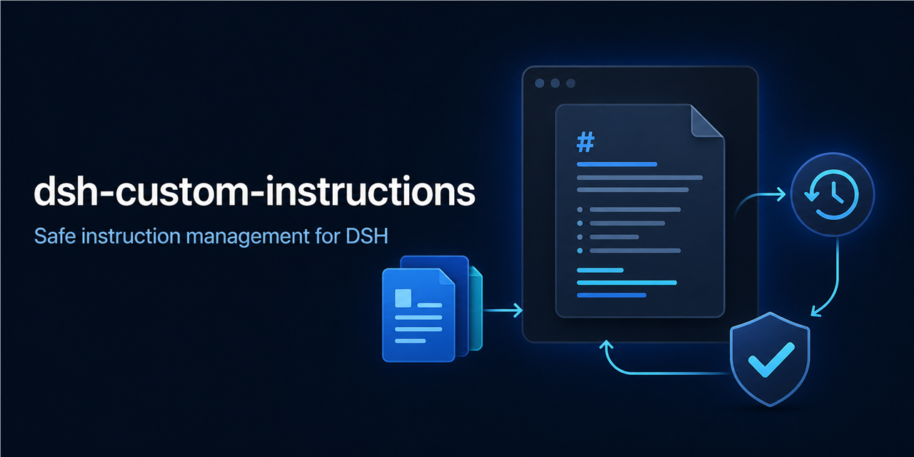
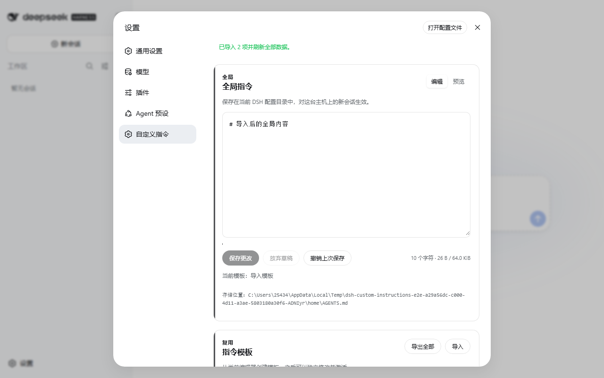

# dsh-custom-instructions

[English](README.en.md) · [更新日志](CHANGELOG.md) · [安全策略](SECURITY.md) · [参与贡献](CONTRIBUTING.md)

[](https://github.com/huanghai-lab/dsh-custom-instructions/actions/workflows/ci.yml)
[](https://www.npmjs.com/package/@huanghai-lab/dsh-custom-instructions)
[](https://www.npmjs.com/package/@huanghai-lab/dsh-custom-instructions)
[](LICENSE)



DSH Web 的安全指令管理器：编辑全局 `AGENTS.md`，复用模板，预览 Markdown，恢复历史，并在跨窗口或外部修改时阻止静默覆盖。

它不是单一的规则文本框，而是面向可迁移、可恢复和并发安全维护的全局指令工作台。

> 正式版 v0.5.0 适配 DSH `0.1.2-alpha.1`，并通过官方标签源码构建、插件 tarball 隔离安装与真实浏览器 E2E。

> DSH `0.1.1-rc.2` 用户请锁定插件 v0.4.0；更早的 DSH 请继续使用 v0.3.0。

## 快速开始

前提：Node.js `^22.19.0 || >=24.0.0`、pnpm，以及 DSH `0.1.2-alpha.1`。

```bash
dsh plugin --profile web add @huanghai-lab/dsh-custom-instructions
dsh web
```

重启 Web profile 后，打开 **设置 → 自定义指令**。

需要锁定正式版本时：

```bash
dsh plugin --profile web add @huanghai-lab/dsh-custom-instructions@0.5.0
```



英文界面截图见 [docs/assets/settings-en.png](docs/assets/settings-en.png)。界面跟随 DSH 语言设置，缺少翻译时回退到英文。

## 功能

| 功能 | 当前行为 |
|---|---|
| 全局指令 | 保存、放弃草稿、撤销上次保存、编辑/Markdown 预览；限制 65 KiB |
| 浏览器草稿 | 按 DSH profile 存在 `sessionStorage`；保存或主动放弃后清除 |
| 并发保护 | 所有写入校验磁盘 `revision`；冲突时保留草稿，只允许复制或重新加载 |
| 模板 | 支持中英文名称、独立编辑/预览/保存、激活和确认删除；最多 50 个 |
| 历史 | 覆盖前自动快照，可展开预览和确认恢复；最多保留最新 100 条 |
| 导入导出 | 迁移当前内容、模板、历史和激活状态；严格校验、合并、失败回滚 |
| 项目指令概览 | 只读展示已注册工作区的项目级 `AGENTS.md` 状态 |
| 无障碍 | 键盘保存、焦点恢复、ARIA、原生确认框/文件选择器和窄屏布局 |

Markdown 预览直接使用 DSH 官方 `MarkdownText`，没有引入另一套 Markdown 解析器。

## 数据安全

- 插件只写当前 `$DSH_HOME/AGENTS.md` 和同目录下的 `instructions/` 数据，不会修改项目级 `AGENTS.md`。
- 写请求必须携带根据实际磁盘内容生成的 SHA-256 `revision`。多窗口或插件外修改会返回 `409`，不会静默覆盖。
- 同一 DSH 进程内的修改串行执行；文件通过同目录临时文件写入、回读校验后替换。
- 全局内容每次覆盖前写入 `AGENTS.md.bak` 和历史记录；只有备份文件确实存在时，界面才显示可撤销。
- 导入先完整校验，再合并。失败时从导入前快照回滚；最近一次导入前快照保存在 `instructions/import-rollback.json`。
- 单项内容最多 65 KiB，导入最多 50 个模板、100 条历史，请求体最多 16 MiB。
- 本插件不加入产品遥测。DSH 自身的遥测设置不由本插件改变。

导出文件、备份、历史和回滚包都可能含有私人指令或路径，请按敏感文件保存，不要直接贴到公开 Issue。

## 存储位置

```text
$DSH_HOME/
├── AGENTS.md
├── AGENTS.md.bak
└── instructions/
    ├── active.json
    ├── import-rollback.json
    ├── templates/
    └── history/
```

模板物理文件名使用 Node 原生 Base64URL 编码，模板显示名称不会直接拼入路径。

## 升级与版本选择

```bash
dsh plugin --profile web add @huanghai-lab/dsh-custom-instructions@0.5.0
```

从 v0.3.0 升级前建议先导出一次数据。v0.5.0 会继续读取 v0.3 的 ASCII 模板和数字历史 ID；旧模板第一次成功写入时会迁移到编码文件名。v0.3 导出包及缺少 `format` 字段的旧包会按 v0.3 格式解析。

如果 DSH 仍是 `0.1.1-rc.2`，请锁定插件 v0.4.0：

```bash
dsh plugin --profile web add @huanghai-lab/dsh-custom-instructions@0.4.0
```

## 导入规则

- 同名模板更新，本地额外模板保留；合并后超过 50 个模板会整体拒绝。
- 历史记录按 ID 合并，并裁剪为最新 100 条。
- 当前内容和激活状态会随包导入；激活模板必须在合并后的模板集合中存在。
- 任意模板、历史或字段非法，整次导入都不会执行。
- 导入文件只包含已保存数据，不包含页面上尚未保存的浏览器草稿。

## 常见问题

### 设置里没有“自定义指令”

确认安装目标是 `web` profile，并在安装后重启 DSH：

```bash
dsh plugin --profile web why @huanghai-lab/dsh-custom-instructions
dsh web
```

### 页面提示版本冲突

先点“复制草稿”，再点“加载最新内容”，手动合并后重新保存。不要通过重复点击绕过冲突。

### 页面加载失败或无法写入

检查界面显示的存储路径、`$DSH_HOME` 权限和 DSH 日志。服务端会区分 `400`、`404`、`409`、`413` 与 `500`，客户端也会显示网络、空响应和非 JSON 响应错误。

### DSH 升级后插件无法加载

正式版 v0.5.0 只承诺兼容 `0.1.2-alpha.1`。它已移除该版本删除的客户端 runtime 依赖，适配新版 Markdown 标签和浏览器鉴权接口，并在官方标签源码构建中完成隔离安装验证。DSH `0.1.1-rc.2` 用户请使用插件 v0.4.0。

## 兼容矩阵

| 插件版本 | DSH | Node.js | 状态 |
|---|---|---|---|
| v0.5.0 (`latest`) | `0.1.2-alpha.1` | `^22.19.0 || >=24` | 正式版；官方标签源码构建、插件 tarball 隔离安装与真实浏览器 E2E 已通过 |
| v0.4.0 | `0.1.1-rc.2` | `^22.19.0 || >=24` | 已发布并通过隔离安装 E2E |
| v0.3.0 | `0.1.0-rc.6` | `^22.19.0 || >=24` | 旧环境保留 |

## 开发与验证

```bash
pnpm install --frozen-lockfile
pnpm typecheck
pnpm test
pnpm build
pnpm compat:dsh /path/to/deepseek-harness
pnpm typecheck:dsh-source /path/to/deepseek-harness
pnpm e2e -- /path/to/deepseek-harness
```

先在官方 `dsh-v0.1.2-alpha.1` 源码目录完成锁定安装与构建。`pnpm e2e -- <源码目录>` 会使用该构建和当前插件 tarball，在系统临时目录创建隔离的 `DSH_HOME` 与 workspace，再真实验证一次性登录、保存、预览、模板、历史、导入导出和中英文界面。它不会接触用户真实的 `AGENTS.md`。

`pnpm compat:dsh` 校验 DSH 源码目录中的客户端 Context、Markdown、设置页、工作区和 Web 路由接口。CI 会直接检出官方 `dsh-v0.1.2-alpha.1` 标签执行这项检查。

CI 在 Ubuntu 与 Windows 的 Node 24 上执行锁定安装、类型检查、测试和构建，并检查提交的 `lib/` 没有落后源码；Ubuntu 还会构建官方 alpha 标签、执行源码类型检查和隔离浏览器 E2E。上游 npm 包可安装后，仍需补跑一次 npm 安装链路复核发布物。

## 参与项目

发现问题请使用 [Issue 模板](https://github.com/huanghai-lab/dsh-custom-instructions/issues/new/choose)，使用经验和想法可以发到 [Discussions](https://github.com/huanghai-lab/dsh-custom-instructions/discussions)。安全问题请按 [SECURITY.md](SECURITY.md) 私下报告。

如果这个插件确实解决了你的问题，欢迎 Star、分享实际使用场景，或提交可复现的反馈。真实反馈比泛泛宣传更有帮助。

## 许可证

[Apache-2.0](LICENSE)
